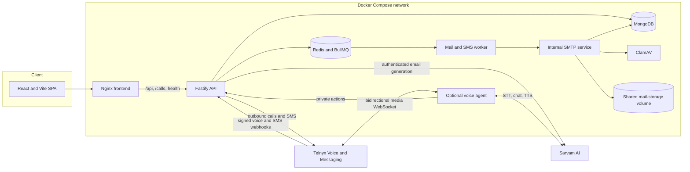
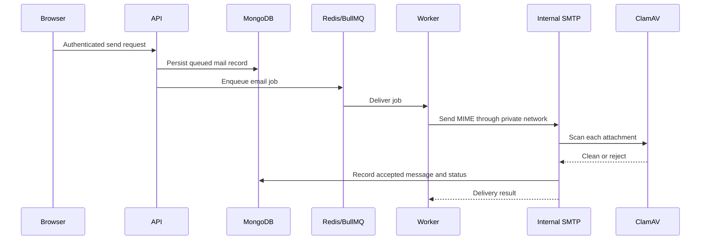

# Syscall architecture

## System overview

Syscall is a self-hosted mail application in which an active user's Indian mobile number maps to an address on a local mail domain, for example `9876543210@niti`. The browser application handles mailbox, profile, authentication, and compose interactions. The Fastify API is the authority for sessions, user and mail state, provider integrations, and queue creation. A separate SMTP service validates and scans mail, while a BullMQ worker performs delivery and notifications. An optional voice agent connects Telnyx call audio to Sarvam speech and conversation services.

MongoDB holds durable account and mail records, including one-time password-reset tokens. Redis holds sessions, BullMQ state, OTP verification state, and short-lived voice call authorization and drafts. Raw MIME and attachment files are stored on a shared Docker volume.

## Component topology

## Service responsibilities

| Component | Responsibility |
| --- | --- |
| `frontend/` | React/Vite single-page app: signup and sign in, mailbox, compose, scheduling, profile, and session-aware routing. |
| `docker/frontend` | Builds the frontend and serves it with Nginx. Nginx proxies same-origin `/api/`, `/calls/`, `/ready`, and `/health` paths to the API. `/healthz` is a frontend-only check. |
| `apps/api/` | Fastify routes for auth, onboarding, profile, mail, drafts, Sarvam compose requests, call creation, Telnyx webhooks, and private voice-agent actions. It applies domain rules and enqueues asynchronous work. |
| `apps/voice-agent/` | Validates call-stream tickets, processes the Telnyx media WebSocket, manages turn state, and invokes narrowly scoped API actions. Sarvam provides realtime speech recognition, language detection, chat, and synthesis. |
| `apps/smtp/` | Internal SMTP ingress. It validates local sender and recipient addresses, parses MIME, enforces attachment limits, scans attachments with ClamAV, and records accepted mail. |
| `apps/worker/` | Processes queued and delayed email jobs, recovers schedules from MongoDB, retries SMTP delivery, and sends configured SMS notifications. |
| MongoDB | Durable users, email, draft, audit, and webhook-event records. |
| Redis | Opaque session state, BullMQ jobs, OTP verification state, and expiring call-scoped authorization and composition state. |
| ClamAV | Scans SMTP attachments. Accepted attachments require a successful scanner response. |
| Shared mail-storage volume | Raw `.eml` files and generated attachment files, shared between API, SMTP, and worker containers as needed. |
| `packages/` | Shared typed configuration, Mongoose models, validation/domain rules, queue helpers, logging, MIME/storage/scanning helpers, and Telnyx integration. |

The default Compose profile includes MongoDB, Redis, ClamAV, API, frontend, SMTP, and worker. `voice-agent` is opt-in through the `voice` profile.

## Browser and API boundary

The browser is served from one origin. In Compose, Nginx proxies `/api/` and `/calls/` to `api:3000`, and proxies `/health` and `/ready` to the corresponding API checks. Vite configures matching development proxies to `localhost:3000`. This keeps browser traffic same-origin and does not require permissive API CORS settings.

Authenticated API requests use the `X-Session-Token` header. The frontend keeps the opaque token in tab-scoped `sessionStorage` and calls `/api/auth/me` during startup to restore a session. Cached profile data is not treated as proof of authentication.

### Route groups

| Route group | Purpose |
| --- | --- |
| `/api/auth/*` | OTP issue/verification, password login and setup, session inspection/revocation, forgot-password and reset. |
| `/api/onboarding/call-request` | Starts the IVR account onboarding call with a short-lived name and stream ticket. |
| `/api/ai/compose` | Authenticated Sarvam 105B email creation or revision. |
| `/api/mail/*` | Mailbox listing/details, send/reply, schedule management, attachments, stars, spam, trash, restore, and delete. |
| `/api/drafts/*` | Attachment-aware draft create, read, update, delete, and send operations. |
| `/api/profile` | Read and update the account display name and avatar. |
| `/calls/start` | Starts a general outbound call without account-creation authority. |
| `/webhooks/telnyx/*` | Telnyx voice and SMS event callbacks. Provider signatures are verified and event IDs deduplicated; inbound voice calls are verified by SMS OTP before media streaming starts. |
| `/internal/voice/*` | Private, token-protected call activation, call-scoped actions, time context, and cleanup for the voice agent. Inbound personal actions require a verified call context. |
| `/health`, `/ready` | API liveness and dependency readiness. |

## Account creation and authentication

### IVR account creation

1. The create-account form collects a name and Indian mobile number, then calls `POST /api/onboarding/call-request`.
2. The API normalizes the number, rate-limits setup calls, rejects an existing active account, and stores a short-lived hashed stream ticket with the requested name in Redis.
3. Telnyx places the call and opens a media stream to the voice agent. The agent validates and consumes the one-time ticket through the authenticated internal API.
4. The assistant reads the name back and requires caller confirmation. It then asks for explicit permission to create the account. The API only exposes the account-creation action at the appropriate state in this call.
5. After the account has been created through the call, the user can choose **New User? Set Password** on the sign in page. The flow verifies the mobile number by SMS OTP and sets the account's initial password.

Ordinary outbound calls do not receive account-creation tools. The caller-name confirmation and explicit consent checks are enforced server-side as well as in the conversational flow.

### Inbound voice calls

1. Telnyx posts an inbound `call.initiated` event to the signed voice webhook. The API checks the called number, answers the call, and sends a six-digit OTP to the caller number with per-call and daily limits.
2. Telnyx speaks the keypad prompt and gathers six digits followed by `#`. The OTP is stored as a call-bound hash; raw digits are handled only by the signed webhook and never enter Sarvam transcription or chat.
3. The API validates the gather event and OTP before starting the media stream. Invalid, expired, or exhausted attempts do not create a voice-agent session or enable personal actions.
4. After verification, existing accounts receive the ordinary voice assistant. A new number enters account setup: the assistant collects and confirms a name, then requires explicit consent before creating the account.
5. The inbound stream ticket is one-use, bound to the verified phone and call direction, and server-side action checks reject unverified inbound call contexts.

### OTP, password, and sessions

OTP requests enforce cooldown and failure limits. The service stores a hash of each short-lived code and sends it through the SMS queue. Successful verification creates an opaque Redis-backed session. New accounts set their initial password after verification; existing users can sign in by password or OTP. Passwords use Argon2id. Forgot-password responses are generic to avoid revealing whether a phone number belongs to an account, and reset credentials are single-use and expire.

## Sarvam email writing

The compose panel places a single-line prompt between the subject and message body. It supports both first drafts and edits to the current draft.

1. The authenticated frontend sends the user's instruction, current subject, and current text body to `POST /api/ai/compose`.
2. The API validates input size, checks for `SARVAM_API_KEY`, and sends the prompt and current draft context to Sarvam's `sarvam-105b` chat-completions endpoint.
3. The API requires a JSON response with non-empty `subject` and `textBody` strings and validates their maximum lengths.
4. The frontend replaces both compose fields with the result. The user can edit the result before sending or saving the draft.

The compose API does not deliver mail or persist a draft; normal compose, draft, and send routes remain responsible for those actions. If the key is absent, the API returns a configuration error.

## Mail delivery and storage

The API derives the sender identity from the authenticated user and validates local recipients. The worker constructs MIME and sends through the internal SMTP service. SMTP validates identities, parses the message, enforces attachment size, scans each attachment, stores generated attachment files and raw MIME, and records the accepted message. ClamAV unavailability is treated as a temporary SMTP failure; attachments are not accepted without a successful scan.

### Scheduled mail

Scheduled messages are stored in MongoDB with `deliveryStatus: scheduled`, a UTC delivery time, and a monotonically increasing `scheduleVersion`. BullMQ holds a delayed job keyed by message ID and version. The worker atomically transitions only the matching due version to queued before using the normal SMTP path. A recovery pass recreates missing delayed jobs from MongoDB records.

Rescheduling creates a new version and invalidates the previous job. Cancellation changes the durable state and version before best-effort queue removal. Stale jobs therefore cannot send a cancelled or superseded schedule. Scheduling is limited to 1 minute through 365 days in the future. Recipients do not see a scheduled message before delivery begins; only the sender can list and manage pending schedules.

## Voice assistant and Telnyx

The optional voice profile connects Telnyx calls to Sarvam realtime STT, chat, VAD, and TTS. The agent handles a bidirectional 8 kHz mono PCMU media stream and packetizes synthesized audio into Telnyx media frames. Speech-start events can interrupt active synthesis, clear queued playback, and abort an in-flight response.

The initial greeting is bilingual English/Hindi. Sarvam detects the language for each caller turn; the voice agent selects a supported voice from that turn's locale and transcript script so a caller can change languages mid-call. Supported output languages are English, Hindi, Bengali, Tamil, Telugu, Kannada, Malayalam, Marathi, Gujarati, Punjabi, and Odia. The call is conversational and does not use a keypad or DTMF menu.

For email actions, the assistant gathers the recipient's ten-digit number, subject, and complete plain-text body. The API derives the sender from the active call's bound phone number, adds `LOCAL_MAIL_DOMAIN` to the recipient, and requires an existing active account. Before an immediate send or schedule, the assistant reads back the destination and summary/time and obtains an unambiguous confirmation. It can list, cancel, or reschedule pending voice-created schedules. Voice message content is held briefly in call-scoped Redis state and is not written to application logs.

## Persistence model

MongoDB records include:

- **Users:** UUIDv7 public ID, normalized phone and local address, display name, avatar key, Argon2id password hash, password/account state, and timestamps.
- **Emails:** UUIDv7 public ID, sender/recipient references and addresses, content, RFC thread headers, attachment metadata and raw MIME path, delivery/read/spam state, participant-scoped star/trash/delete state, schedule time/version/source, and timestamps.
- **Drafts:** UUIDv7 public ID, owner, recipient, subject/body, attachment metadata, state, and timestamps.
- **Audit logs:** event type, optional actor and related IDs, timestamp, and non-sensitive metadata.
- **Webhook events:** provider event ID and processing time, with a unique index for idempotency.

Redis holds opaque session data, queue state, OTP verification state, and short-lived call tickets/context. MongoDB stores one-time password-reset tokens. Session, OTP, reset, and call-ticket secrets are stored as hashes where applicable. Indexes support phone/address uniqueness, public IDs, inbox queries, owner-scoped drafts, expiry lookups, audit timestamps, and webhook deduplication.

## Network boundaries

- The API is published on the host at `API_PORT` (default `3000`) for local development. MongoDB, Redis, SMTP, and ClamAV are internal Compose services.
- The frontend is published at `FRONTEND_PORT` (default `8080`). Browser requests use its same-origin Nginx proxy.
- The voice agent's host port binds to loopback. It is included only with the `voice` Compose profile.
- Tailscale Funnel is optional. The included helper publishes the Telnyx webhook paths and `/voice-stream` only; it keeps data stores, SMTP, ClamAV, and other API routes private.
- Telnyx webhook signature verification remains enabled. The shared `VOICE_AGENT_API_TOKEN` protects internal agent actions.

## Recovery and operational behavior

- MongoDB is authoritative for accounts, mail, and schedule state; Redis queue loss does not erase schedule records.
- The worker periodically reconciles pending schedules against BullMQ delayed jobs.
- Telnyx webhook event IDs are persisted to make provider event handling idempotent.
- SMTP retries temporary provider or scanner failures through the worker. A voice-scheduled email failure notification is queued only after delivery was attempted and retries are exhausted.
- `/health` indicates API liveness. `/ready` checks required API dependencies. The frontend's `/healthz` checks that Nginx is serving.
- `docker compose down -v` removes MongoDB, Redis, and mail-storage volumes and permanently deletes local persisted data.

## Current boundaries

Syscall currently handles mail within its configured local domain. External email, public MX/DNS, aliases, groups, and multi-host object storage are out of scope. Voice mail actions currently derive the sender from the phone number bound to the active Telnyx call; an additional OTP/account-authentication step for voice mail is a future safeguard. Telnyx call quality, webhook reachability, and SMS delivery depend on provider account setup. Review call/signup rate limits and deployment exposure before using a publicly reachable instance.
