# Syscall

<p align="center">
  <strong>Mail built around your mobile number.</strong><br />
  A private, phone-addressed email service with a browser inbox and a conversational voice assistant.
</p>

<p align="center">
  <a href="https://github.com/TS47Andres/Syscall"></a>
  
  
  
  
</p>

<p align="center">
  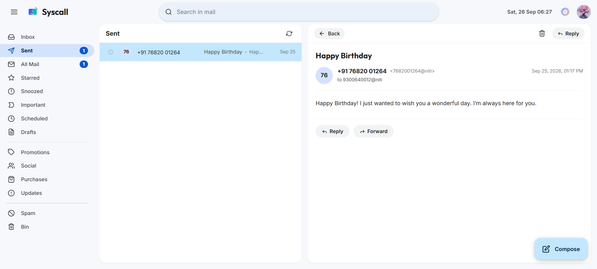
</p>

Syscall gives each active account a local mail address derived from its verified Indian mobile number, such as `9876543210@niti`. It combines a React mail client with an API, internal SMTP delivery, background workers, and an optional Telnyx voice assistant.

> **Status:** Self-hosted development project. Telnyx and Sarvam powered features need provider credentials and webhook setup before they can be used. See [setup](#quick-start) and [provider setup](#provider-setup).

## Contents

- [Highlights](#highlights)
- [Feature gallery](#feature-gallery)
- [Mobile app screenshots](#mobile-app-screenshots)
- [Mobile app development](#mobile-app-development)
- [How it fits together](#how-it-fits-together)
- [Quick start](#quick-start)
- [Configuration](#configuration)
- [Provider setup](#provider-setup)
- [Development](#development)
- [Health checks and logs](#health-checks-and-logs)
- [API examples](#api-examples)
- [Security and current scope](#security-and-current-scope)
- [Repository map](#repository-map)
- [More documentation](#more-documentation)

## Highlights

- **Phone-addressed accounts:** a caller confirms their name over an onboarding call, and the account is created by the IVR flow.
- **OTP and password access:** sign in with a password or a one-time code. New users can verify their mobile number and set an initial password from the sign in page.
- **Mail essentials:** inbox, sent, all mail, categories, stars, spam, trash, replies, drafts, and attachments.
- **Write with Sarvam:** describe a new email or ask for edits. The Sarvam 105B model receives the current subject and message as context and returns an updated subject and complete message body.
- **Send later:** schedule delivery, then review, reschedule, or cancel messages while they are still pending.
- **Attachment scanning:** the internal SMTP service checks incoming attachments with ClamAV before accepting a message.
- **Voice assistant:** an optional multilingual assistant handles account setup and supported mail actions over Telnyx calls, with Sarvam speech services.
- **Self-hosted services:** Docker Compose runs the app and its data services together, with databases and SMTP kept off the public interface.

## Feature gallery

These are the feature images displayed in the sign in page carousel.

<table>
  <tr>
    <td align="center" width="50%">
      <br />
      <strong>Phone-linked email</strong><br />
      Send and receive mail using local addresses derived from mobile numbers.
    </td>
    <td align="center" width="50%">
      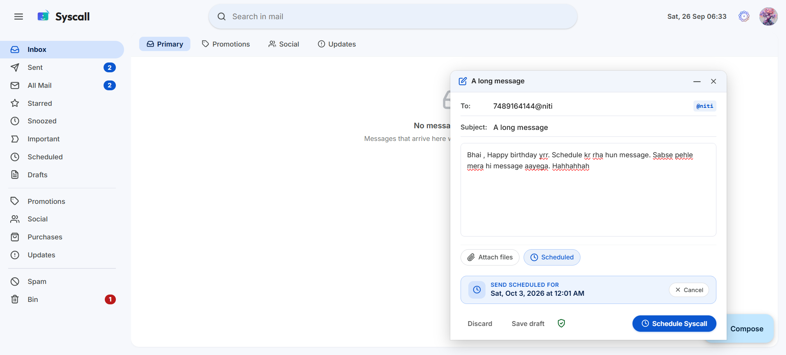<br />
      <strong>Scheduled delivery</strong><br />
      Pick a future date and time, then manage pending messages from Scheduled.
    </td>
  </tr>
  <tr>
    <td align="center" width="50%">
      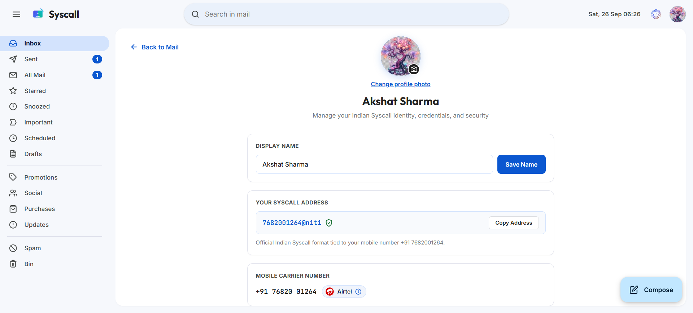<br />
      <strong>Profile management</strong><br />
      Manage your display name, profile image, and account settings.
    </td>
    <td align="center" width="50%">
      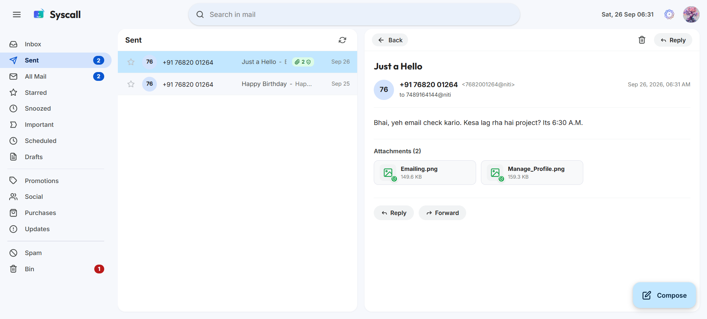<br />
      <strong>Attachment scanning</strong><br />
      ClamAV scans attached files as mail enters the internal mail service.
    </td>
  </tr>
</table>

## Mobile app screenshots

The native Expo app uses React Native views and calls the Syscall API directly; it does not load the web app in a WebView. These Android screenshots were captured in Expo Go. The mailbox-loading image shows the brief transition while opening a signed-in mailbox.

| Screen | Preview |
| --- | --- |
| Sign in | 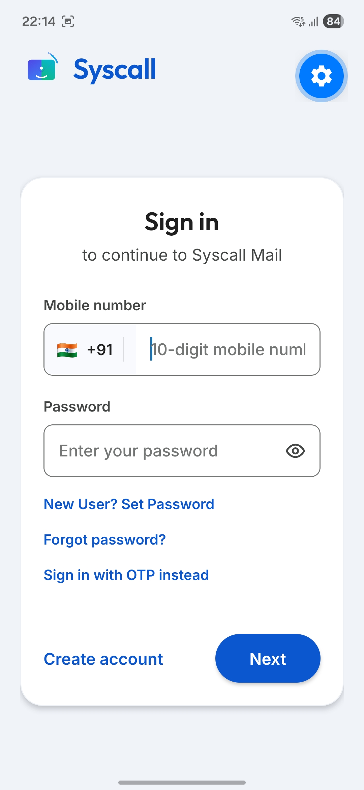 |
| Mailbox loading | 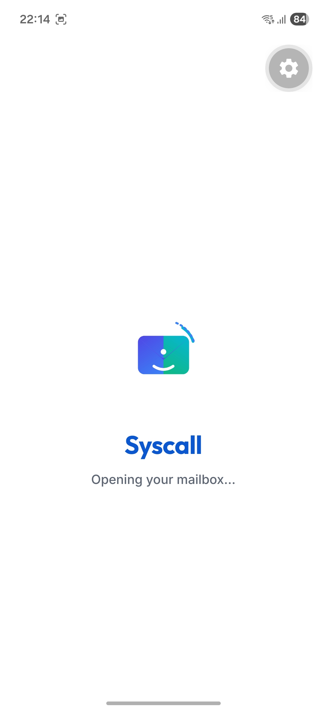 |
| Compose message | 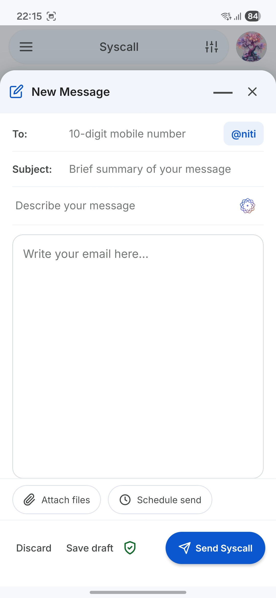 |
| Profile: personal information | 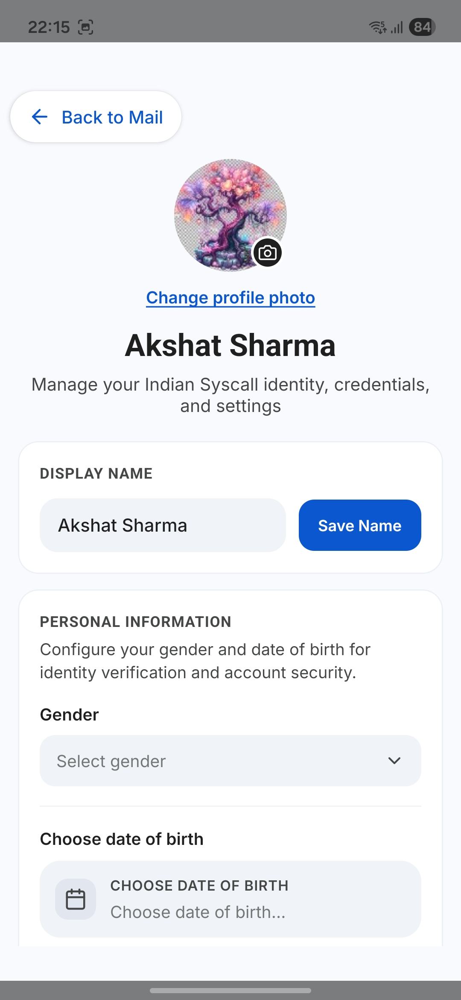 |
| Profile: address and settings | 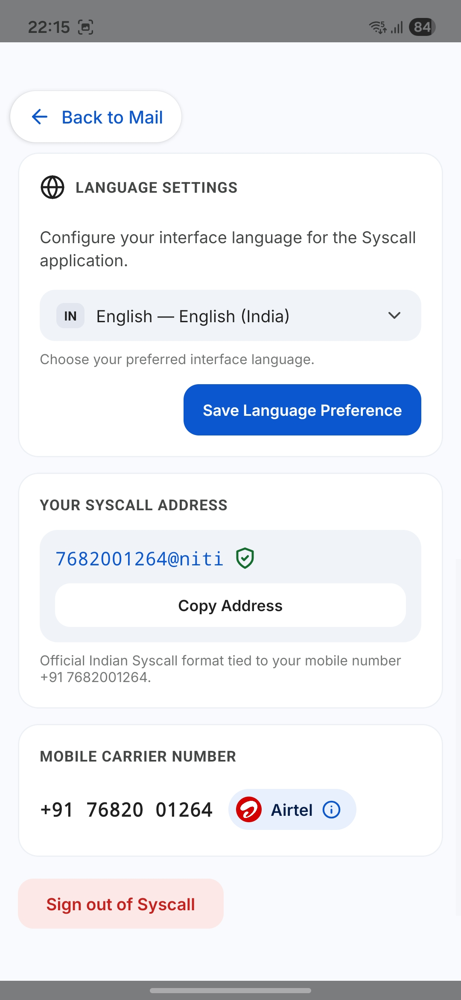 |
| Mailbox navigation | 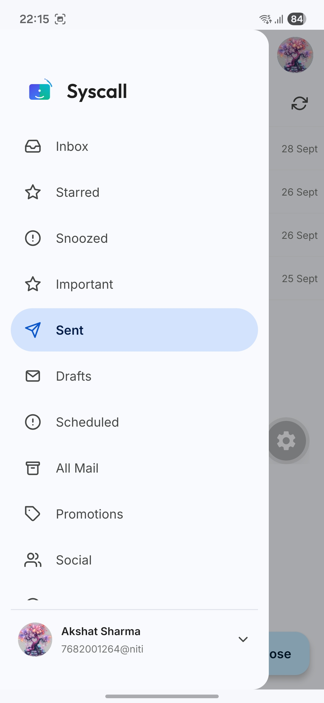 |
| Message with attachments | 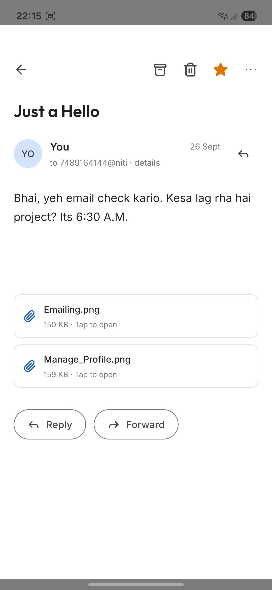 |
| Sent mailbox | 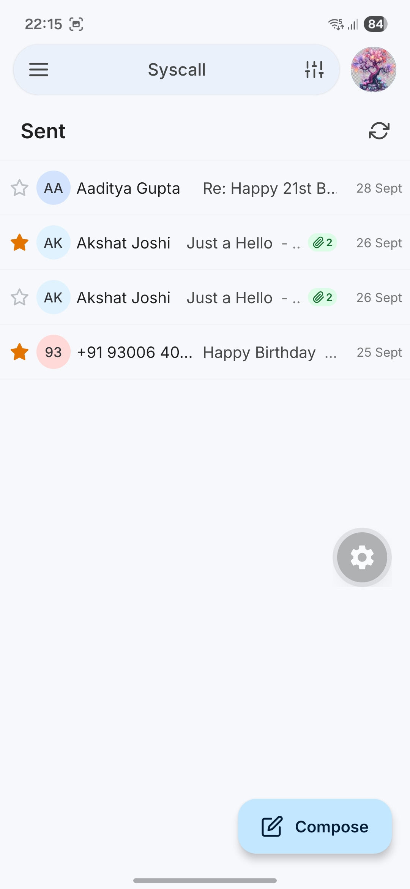 |
| Message reader | 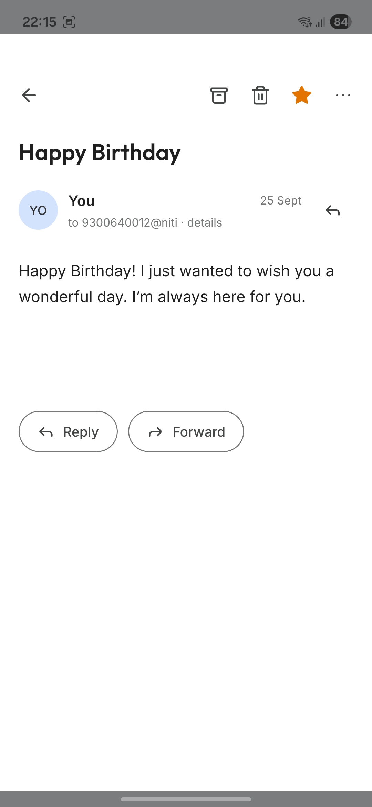 |
| Search filters | 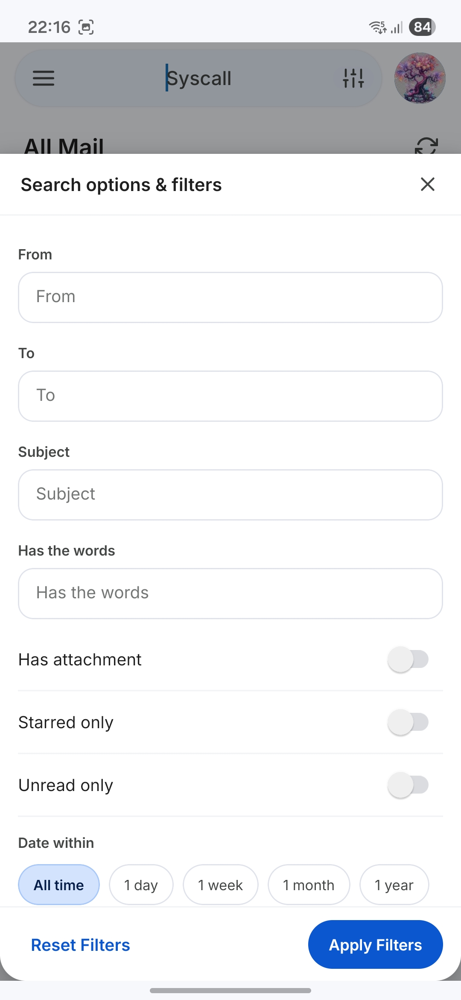 |

## Mobile app development

### Run with Expo Go

Set `EXPO_PUBLIC_API_URL` in `mobile-frontend/.env` to an API URL the phone can reach. For a physical phone, use the development computer's LAN IP and keep both devices on the same network. The API uses port `3000` by default. Start the API, then run:

```powershell
cd mobile-frontend
npm run start:go
```

Scan the Metro QR code with Expo Go on Android or iOS.

### Remote push notifications

Remote push delivery requires a development build; Expo Go cannot test remote push on Android from SDK 53 onward. Notification token registration and notification-open navigation are enabled in development and standalone builds.

1. From `mobile-frontend/`, link the app to an EAS project with `npx eas-cli@latest init`.
2. Set `EXPO_PUBLIC_EAS_PROJECT_ID` in `mobile-frontend/.env`.
3. Configure Android FCM v1 credentials and the iOS APNs key in EAS.
4. Build and install a development client:

Run these commands from `mobile-frontend/`:

```powershell
npx eas-cli@latest build --profile development --platform android
npx eas-cli@latest build --profile development --platform ios
npm run start:dev-client
```

An Apple Developer account is required for iOS device push credentials.

### API address

`EXPO_PUBLIC_API_URL` is the API service root without a trailing slash. For an Android emulator use `http://10.0.2.2:3000`; for the iOS simulator use `http://localhost:3000`. Production builds should use a public HTTPS URL.

## How it fits together


The frontend container serves the built single-page app and proxies API requests to the API container. The API owns authentication, account and mail rules, provider webhooks, and queue creation. The worker performs asynchronous mail delivery and notifications. SMTP parses and validates mail, scans attachments, and stores accepted messages. MongoDB is the durable record; Redis backs sessions, queues, and short-lived voice call state.

See [ARCHITECTURE.md](ARCHITECTURE.md) for service responsibilities, request flows, persistence, and security boundaries.

## Quick start

### Requirements

- Docker Desktop with Docker Compose v2
- Git
- Node.js 22 or newer for local development outside Docker

### Start the core stack

```powershell
Copy-Item .env.example .env
docker compose up -d --build
```

The frontend is available at [http://localhost:8080](http://localhost:8080). Change `FRONTEND_PORT` in `.env` if that port is already in use.

The default profile starts MongoDB, Redis, ClamAV, the API, internal SMTP, the mail worker, and the browser frontend. The voice agent is optional:

```powershell
docker compose --profile voice up -d --build
```

Core services can start with provider settings left blank, but phone calls, SMS, email-writing assistance, and voice AI need the corresponding configuration. See [Provider setup](#provider-setup). Do not put real credentials in source control.

### Stop the stack

```powershell
docker compose down
```

To remove the local MongoDB and Redis data as well as mail files, run `docker compose down -v`. This deletes the named volumes and their data.

## Configuration

Start from [.env.example](.env.example). Docker Compose provides internal host names for MongoDB, Redis, SMTP, and ClamAV; the sample file is configured for those names.

| Setting | Purpose |
| --- | --- |
| `API_PORT` | Host port for the API; default `3000`. |
| `FRONTEND_PORT` | Host port for the browser app; default `8080`. |
| `LOCAL_MAIL_DOMAIN` | Local address suffix; default `niti`. |
| `MONGODB_URI`, `REDIS_URL` | MongoDB and Redis connection strings. |
| `TELNYX_API_KEY`, `TELNYX_PUBLIC_KEY` | Telnyx API access and webhook signature verification. |
| `TELNYX_PHONE_NUMBER`, `TELNYX_CONNECTION_ID` | Outbound voice calling configuration. |
| `TELNYX_MESSAGING_PROFILE_ID`, `TELNYX_MESSAGING_SENDER_ID` | SMS sending configuration. |
| `PUBLIC_WEBHOOK_BASE_URL` | Public HTTPS base URL Telnyx can reach. |
| `SARVAM_API_KEY` | Sarvam email writing and optional voice assistant AI. |
| `VOICE_AGENT_API_TOKEN` | Shared secret between the API and optional voice agent. |
| `MAX_ATTACHMENT_SIZE_MB` | Maximum accepted attachment size; default `10`. |
| `ATTACHMENT_STORAGE_PATH`, `RAW_MAIL_STORAGE_PATH` | Paths on the shared mail-storage volume. |

Authentication expiry and OTP limits, SMTP limits, and ClamAV settings are also configurable in `.env.example`.

## Provider setup

### Telnyx calls and SMS

1. Create/configure a Telnyx Voice API application, outbound connection, and assigned phone number.
2. Create/configure a Messaging Profile and assign its sender number.
3. Fill in the Telnyx API key, public key, connection ID, messaging profile ID, and sender settings in `.env`.
4. Make the Telnyx webhook endpoints reachable over HTTPS and set `PUBLIC_WEBHOOK_BASE_URL`.
5. Start the `voice` profile for the media-stream assistant and configure Telnyx with the webhook endpoints below.

```text
https://<public-host>/webhooks/telnyx/voice
https://<public-host>/webhooks/telnyx/sms
```

### Sarvam AI

Set `SARVAM_API_KEY` for the compose email writer. The browser sends its instruction plus the current subject and body to the authenticated API route, and the API calls the Sarvam 105B chat-completions endpoint. The same key is used by the optional voice agent for its speech and conversation features.

### Optional Tailscale Funnel

For a local development setup, the repository includes a Windows helper for publishing only the Telnyx webhook and voice stream paths through Tailscale Funnel:

```powershell
npm run tailscale:funnel
npm run tailscale:funnel:status
npm run tailscale:funnel:reset
```

Install and sign in to Tailscale first. The helper checks the API and voice-agent health endpoints and binds host ports to loopback. After enabling Funnel, use its HTTPS hostname as `PUBLIC_WEBHOOK_BASE_URL`, restart the services, and use that hostname in the Telnyx webhook URLs. See [ARCHITECTURE.md](ARCHITECTURE.md#network-boundaries) for the exposed paths and private services.

## Development

Install the monorepo dependencies from the root:

```powershell
npm ci
```

Run the frontend in Vite's development server while the API and infrastructure are running:

```powershell
npm --prefix frontend ci
npm --prefix frontend run dev
```

Vite serves the app on its configured development port and proxies `/api`, `/calls`, `/ready`, and `/health` to `http://localhost:3000`.

Useful root scripts:

| Command | Purpose |
| --- | --- |
| `npm run api` | Run the API with `tsx`. |
| `npm run smtp` | Run the internal SMTP service. |
| `npm run worker` | Run the background worker. |
| `npm run voice-agent` | Run the voice agent. |
| `npm run typecheck` | Type-check the TypeScript workspaces. |
| `npm test` | Run the Vitest suite. |
| `npm run status` | Print local service status. |
| `npm run telnyx:config` | Print the Telnyx webhook configuration. |

The frontend also has `npm --prefix frontend run build` for a production build.

## Health checks and logs

| URL | Checks |
| --- | --- |
| `http://localhost:8080/healthz` | Frontend container health. |
| `http://localhost:8080/health` or `http://localhost:3000/health` | API liveness. |
| `http://localhost:8080/ready` or `http://localhost:3000/ready` | API readiness and dependencies. |
| `http://localhost:4000/health` | Voice agent health when its profile is running. |

Tail logs with:

```powershell
docker compose logs -f frontend api worker smtp
docker compose --profile voice logs -f voice-agent
```

## API examples

Request an OTP for an existing account. The code is delivered by SMS when Telnyx is configured:

```powershell
curl -X POST http://localhost:3000/api/auth/otp/request `
  -H 'content-type: application/json' `
  -d '{"phone":"+919876543210"}'
```

Start a general outbound call:

```powershell
curl -X POST http://localhost:3000/calls/start `
  -H 'content-type: application/json' `
  -d '{"phone":"+919876543210"}'
```

Create a scheduled email with a session token and an explicit India Standard Time offset:

```powershell
curl -X POST http://localhost:3000/api/mail/scheduled `
  -H 'content-type: application/json' `
  -H 'X-Session-Token: <session-token>' `
  -d '{"to":"9300640012@niti","subject":"Happy Birthday","textBody":"Wishing you a wonderful day!","scheduledAt":"2026-10-01T09:00:00+05:30"}'
```

Schedules can be listed at `GET /api/mail/scheduled`, moved with `PATCH /api/mail/scheduled/<publicId>`, and cancelled with `DELETE /api/mail/scheduled/<publicId>` while still pending. The allowed delivery window is 1 minute to 365 days ahead.

## Security and current scope

- Session tokens are opaque and stored in browser `sessionStorage`; the server backs sessions with Redis.
- Passwords are hashed with Argon2id. OTP and reset tokens are stored as hashes and expire.
- Telnyx webhooks are signature-verified and provider event IDs are deduplicated.
- The voice agent's internal API calls require `VOICE_AGENT_API_TOKEN`; setup-call tickets are short-lived and single-use.
- SMTP is internal to the Compose network. ClamAV is required before attachments are accepted.
- Tailscale Funnel is optional. When used, it publishes only the required Telnyx webhook and voice-stream routes; MongoDB, Redis, SMTP, ClamAV, and the rest of the API remain private.
- Mail addresses use the configured local domain. Public MX/DNS, external recipients, groups, and aliases are outside current scope.
- Browser and voice signup use provider-backed calls/SMS. Configure rate limits and review provider exposure before making an instance public.

## Repository map

| Path | Responsibility |
| --- | --- |
| `frontend/` | React/Vite browser app, auth flow, mailbox, profile, compose UI. |
| `mobile-frontend/` | Expo/React Native app, configuration, and mobile UI screenshots. |
| `apps/api/` | Fastify API, authentication, mail orchestration, AI compose route, provider webhooks. |
| `apps/voice-agent/` | Telnyx media stream and Sarvam-powered call assistant. |
| `apps/smtp/` | Internal SMTP ingress, MIME parsing, attachment scanning, message storage. |
| `apps/worker/` | BullMQ delivery, delayed schedules, and SMS notification jobs. |
| `packages/` | Shared config, database models, domain validation, queues, mail helpers, and Telnyx integration. |
| `docker/` | Container build files and Nginx/ClamAV configuration. |
| `scripts/` | Local status, Telnyx configuration, and Tailscale helpers. |
| `ARCHITECTURE.md` | Detailed service boundaries, data flows, and operational design. |

## More documentation

- [Architecture and data flows](ARCHITECTURE.md)
- [Environment template](.env.example)

<p align="center">
  <sub>Topics: phone-based email · self-hosted mail · React · TypeScript · Fastify · MongoDB · Redis · Docker Compose · Telnyx · Sarvam AI · ClamAV</sub>
</p>
