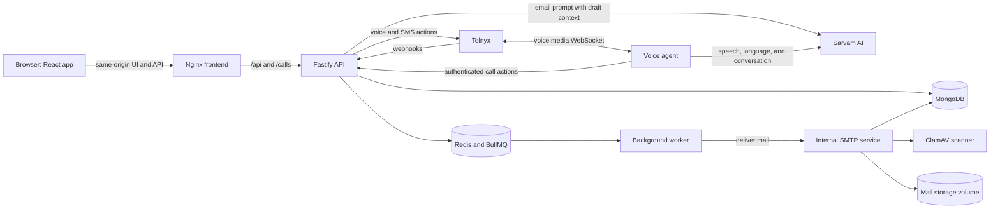

# Syscall

<p align="center">
  <strong>Mail built around your mobile number.</strong><br />
  A private, phone-addressed email service with a browser inbox and a conversational voice assistant.
</p>

<p align="center">
  <a href="https://github.com/TS47Andres/Syscall"></a>
  
  
  
  
</p>

<p align="center">
  
</p>

Syscall gives each active account a local mail address derived from its verified Indian mobile number, such as `9876543210@niti`. It combines browser and mobile mail clients with an API, internal SMTP delivery, background workers, and a Telnyx voice assistant.

> **Status:** Self-hosted development project. The complete deployment includes the voice agent. Telnyx calling and SMS require provider credentials and Tailscale Funnel setup; Sarvam features require an API key. See [Quick start](#quick-start) and [Provider setup](#provider-setup).

## Contents

- [Highlights](#highlights)
- [Feature gallery](#feature-gallery)
- [Mobile app screenshots](#mobile-app-screenshots)
- [Mobile app development](#mobile-app-development)
- [How it fits together](#how-it-fits-together)
- [Quick start](#quick-start)
- [Configuration](#configuration)
- [Provider setup](#provider-setup)
- [Development](#development)
- [Health checks and logs](#health-checks-and-logs)
- [API examples](#api-examples)
- [Security and current scope](#security-and-current-scope)
- [Repository map](#repository-map)
- [More documentation](#more-documentation)

## Highlights

- **Phone-addressed accounts:** a caller confirms their name with the voice agent during an onboarding call, then gives explicit consent before the account is created.
- **OTP and password access:** sign in with a password or a one-time code. New users can verify their mobile number and set an initial password from the sign in page.
- **Mail essentials:** inbox, sent, all mail, categories, stars, spam, trash, replies, drafts, and attachments.
- **Write with Sarvam:** describe a new email or ask for edits. The Sarvam 105B model receives the current subject and message as context and returns an updated subject and complete message body.
- **Send later:** schedule delivery, then review, reschedule, or cancel messages while they are still pending.
- **Attachment scanning:** the internal SMTP service checks incoming attachments with ClamAV before accepting a message.
- **Voice assistant:** the required multilingual voice agent handles account setup and supported mail actions over Telnyx calls, using Sarvam speech services.
- **Self-hosted services:** Docker Compose runs the app and its data services together, with databases and SMTP kept off the public interface.

## Feature gallery

These are the feature images displayed in the sign in page carousel.

<table>
  <tr>
    <td align="center" width="50%">
      <br />
      <strong>Phone-linked email</strong><br />
      Send and receive mail using local addresses derived from mobile numbers.
    </td>
    <td align="center" width="50%">
      <br />
      <strong>Scheduled delivery</strong><br />
      Pick a future date and time, then manage pending messages from Scheduled.
    </td>
  </tr>
  <tr>
    <td align="center" width="50%">
      <br />
      <strong>Profile management</strong><br />
      Manage your display name, profile image, and account settings.
    </td>
    <td align="center" width="50%">
      <br />
      <strong>Attachment scanning</strong><br />
      ClamAV scans attached files as mail enters the internal mail service.
    </td>
  </tr>
</table>

## Mobile app screenshots

The native Expo app uses React Native views and calls the Syscall API directly; it does not load the web app in a WebView. These Android screenshots were captured in Expo Go. The mailbox-loading image shows the brief transition while opening a signed-in mailbox.

| Screen | Preview |
| --- | --- |
| Sign in |  |
| Mailbox loading |  |
| Compose message |  |
| Profile: personal information |  |
| Profile: address and settings |  |
| Mailbox navigation |  |
| Message with attachments |  |
| Sent mailbox |  |
| Message reader |  |
| Search filters |  |

## Mobile app development

The mobile client is an Expo SDK 57 / React Native app. It connects directly to the API; unlike the browser app, it does not use the frontend Nginx proxy.

### Configure the API address

From the repository root, create the mobile environment file:

```powershell
Copy-Item mobile-frontend/.env.example mobile-frontend/.env
```

Edit `mobile-frontend/.env` and set `EXPO_PUBLIC_API_URL` to the API service root without a trailing slash. Replace the example LAN IP with the address that matches where the app is running. Restart Metro after changing this value:

| App location | Example API URL |
| --- | --- |
| Physical phone on the same Wi-Fi as the development computer | `http://<computer-LAN-IP>:3000` |
| Android emulator | `http://10.0.2.2:3000` |
| iOS simulator | `http://localhost:3000` |
| Phone outside the local network | The public HTTPS API hostname; this deployment uses the Tailscale Funnel hostname |

Start the API first. For the normal local setup, use the [Quick start](#quick-start). The mobile app needs a reachable API; voice signup also requires the [required voice profile and Tailscale Funnel](#required-tailscale-funnel). Leave `EXPO_PUBLIC_EAS_PROJECT_ID` empty for basic Expo Go use.

### Start the app in Expo Go

Install Node.js 22 or newer and [Expo Go](https://expo.dev/go) on the Android or iOS device. From the repository root, install the mobile app's dependencies and start Expo:

```powershell
cd mobile-frontend
npm ci
npx expo start
```

Because this project includes `expo-dev-client`, plain `npx expo start` targets a development build by default. To launch in Expo Go, run `npx expo start --go`. Scan the QR code with Expo Go on Android; on iOS, scan it with the Camera app and open it in Expo Go. Keep the phone and development computer on the same Wi-Fi network when using the LAN API address.

If the local network blocks Metro traffic, start Metro with `npx expo start --tunnel`. This Expo tunnel is for the development server; it is separate from the Tailscale Funnel that exposes the backend to Telnyx.

### Remote push notifications

Expo Go is suitable for checking the UI and API flows, but it does not support remote push notifications; test push delivery in a development build. See [Expo's push notification FAQ](https://docs.expo.dev/push-notifications/faq/). Set up EAS and push credentials before testing:

1. From `mobile-frontend/`, link the app to an EAS project with `npx eas-cli@latest init`.
2. Put the project ID in `EXPO_PUBLIC_EAS_PROJECT_ID` in `mobile-frontend/.env`.
3. Configure Android FCM v1 credentials and the iOS APNs key in EAS. An Apple Developer account is required for iOS push credentials.
4. Build and install a development client, then start the dev-client server from `mobile-frontend/`:

```powershell
npx eas-cli@latest build --profile development --platform android
npx eas-cli@latest build --profile development --platform ios
npx expo start --dev-client
```

For details, see [Expo's development server guide](https://docs.expo.dev/get-started/start-developing/) and [push notification setup](https://docs.expo.dev/push-notifications/push-notifications-setup/).

## How it fits together



The frontend container serves the built single-page app and proxies API requests to the API container. The API owns authentication, account and mail rules, provider webhooks, and queue creation. The worker performs asynchronous mail delivery and notifications. SMTP parses and validates mail, scans attachments, and stores accepted messages. MongoDB is the durable record; Redis backs sessions, queues, and short-lived voice call state.

See [ARCHITECTURE.md](ARCHITECTURE.md) for service responsibilities, request flows, persistence, and security boundaries.

## Quick start

### Requirements

- Docker Desktop with Docker Compose v2
- Git
- Node.js 22 or newer for local development outside Docker

### Start the complete stack

```powershell
Copy-Item .env.example .env
```

Before starting, set `SARVAM_API_KEY` and a `VOICE_AGENT_API_TOKEN` of at least 32 characters in `.env`. Generate a token with Node.js:

```powershell
node -e "console.log(require('node:crypto').randomBytes(32).toString('hex'))"
```

Start the complete deployment, including the required voice agent. Compose gates that service behind the named `voice` profile, so include the profile:

```powershell
docker compose --profile voice up -d --build
```

The browser frontend is available at [http://localhost:8080](http://localhost:8080). Change `FRONTEND_PORT` in `.env` if that port is already in use. Telnyx calling and SMS also require provider values and Funnel setup in [Provider setup](#provider-setup). Do not put real credentials in source control.

### Stop the stack

```powershell
docker compose down
```

To remove the local MongoDB and Redis data as well as mail files, run `docker compose down -v`. This deletes the named volumes and their data.

## Configuration

Start from [.env.example](.env.example). Docker Compose provides internal host names for MongoDB, Redis, SMTP, and ClamAV; the sample file is configured for those names.

| Setting | Purpose |
| --- | --- |
| `API_PORT` | Host port for the API; default `3000`. |
| `FRONTEND_PORT` | Host port for the browser app; default `8080`. |
| `LOCAL_MAIL_DOMAIN` | Local address suffix; default `niti`. |
| `MONGODB_URI`, `REDIS_URL` | MongoDB and Redis connection strings. |
| `TELNYX_API_KEY`, `TELNYX_PUBLIC_KEY` | Telnyx API access and webhook signature verification. |
| `TELNYX_PHONE_NUMBER`, `TELNYX_CONNECTION_ID` | Outbound voice calling configuration. |
| `TELNYX_MESSAGING_PROFILE_ID`, `TELNYX_MESSAGING_SENDER_ID` | SMS sending configuration. |
| `PUBLIC_WEBHOOK_BASE_URL` | Public HTTPS base URL Telnyx can reach. |
| `SARVAM_API_KEY` | Required voice-agent speech and conversation services; also enables AI email writing. |
| `VOICE_AGENT_API_TOKEN` | Required 32-character-minimum shared secret between the API and voice agent. |
| `MAX_ATTACHMENT_SIZE_MB` | Maximum accepted attachment size; default `10`. |
| `ATTACHMENT_STORAGE_PATH`, `RAW_MAIL_STORAGE_PATH` | Paths on the shared mail-storage volume. |

Authentication expiry and OTP limits, SMTP limits, and ClamAV settings are also configurable in `.env.example`.

## Provider setup

### Telnyx calls and SMS

1. Create/configure a Telnyx Voice API application, outbound connection, and assigned phone number.
2. Create/configure a Messaging Profile and assign its sender number.
3. Fill in the Telnyx API key, public key, connection ID, messaging profile ID, and sender settings in `.env`.
4. Start the core services and voice agent, then publish the backend using the required Tailscale Funnel setup below.
5. Set `PUBLIC_WEBHOOK_BASE_URL` to the Funnel HTTPS hostname, restart the API, and configure Telnyx with these webhook endpoints:

```text
https://<public-host>/webhooks/telnyx/voice
https://<public-host>/webhooks/telnyx/sms
```

### Sarvam AI

Set `SARVAM_API_KEY` for the required voice agent and for AI email writing. The browser sends its instruction plus the current subject and body to the authenticated API route, and the API calls the Sarvam 105B chat-completions endpoint. The voice agent also uses this key for speech recognition, language detection, conversation, and speech synthesis.

### Required Tailscale Funnel

Telnyx must reach Syscall over the public internet. Tailscale Funnel provides that public HTTPS and WebSocket ingress in this deployment. Install Tailscale on the host, sign in, and start the API and voice agent. The helper checks both health endpoints before configuring Funnel:

```powershell
docker compose --profile voice up -d --build
npm run tailscale:funnel
npm run tailscale:funnel:status
```

Copy the HTTPS hostname shown by `npm run tailscale:funnel:status` into `PUBLIC_WEBHOOK_BASE_URL` in `.env`, then restart the API so it uses the new value:

```powershell
docker compose up -d --force-recreate api
```

The helper publishes the API at the Funnel hostname, maps `/webhooks/telnyx/` to the API, and forwards `/voice-stream` to the voice agent. The API uses `PUBLIC_WEBHOOK_BASE_URL` to generate Telnyx webhook URLs and the secure WebSocket stream URL. Configure the Telnyx voice and SMS webhooks as `https://<funnel-host>/webhooks/telnyx/voice` and `https://<funnel-host>/webhooks/telnyx/sms`. Confirm Funnel is active with `npm run tailscale:funnel:status` before expecting Telnyx calls or messages. Use `npm run tailscale:funnel:reset` only when intentionally disabling the public ingress. See [ARCHITECTURE.md](ARCHITECTURE.md#network-boundaries) for network boundaries.

## Development

Install the monorepo dependencies from the root:

```powershell
npm ci
```

Run the frontend in Vite's development server while the API and infrastructure are running:

```powershell
npm --prefix frontend ci
npm --prefix frontend run dev
```

Vite serves the app on its configured development port and proxies `/api`, `/calls`, `/ready`, and `/health` to `http://localhost:3000`.

Useful root scripts:

| Command | Purpose |
| --- | --- |
| `npm run api` | Run the API with `tsx`. |
| `npm run smtp` | Run the internal SMTP service. |
| `npm run worker` | Run the background worker. |
| `npm run voice-agent` | Run the voice agent. |
| `npm run typecheck` | Type-check the TypeScript workspaces. |
| `npm test` | Run the Vitest suite. |
| `npm run status` | Print local service status. |
| `npm run telnyx:config` | Print the Telnyx webhook configuration. |

The frontend also has `npm --prefix frontend run build` for a production build.

## Health checks and logs

| URL | Checks |
| --- | --- |
| `http://localhost:8080/healthz` | Frontend container health. |
| `http://localhost:8080/health` or `http://localhost:3000/health` | API liveness. |
| `http://localhost:8080/ready` or `http://localhost:3000/ready` | API readiness and dependencies. |
| `http://localhost:4000/health` | Voice agent health when its profile is running. |

Tail logs with:

```powershell
docker compose logs -f frontend api worker smtp
docker compose --profile voice logs -f voice-agent
```

## API examples

Request an OTP for an existing account. The code is delivered by SMS when Telnyx is configured:

```powershell
curl -X POST http://localhost:3000/api/auth/otp/request `
  -H 'content-type: application/json' `
  -d '{"phone":"+919876543210"}'
```

Start a general outbound call:

```powershell
curl -X POST http://localhost:3000/calls/start `
  -H 'content-type: application/json' `
  -d '{"phone":"+919876543210"}'
```

Create a scheduled email with a session token and an explicit India Standard Time offset:

```powershell
curl -X POST http://localhost:3000/api/mail/scheduled `
  -H 'content-type: application/json' `
  -H 'X-Session-Token: <session-token>' `
  -d '{"to":"9300640012@niti","subject":"Happy Birthday","textBody":"Wishing you a wonderful day!","scheduledAt":"2026-10-01T09:00:00+05:30"}'
```

Schedules can be listed at `GET /api/mail/scheduled`, moved with `PATCH /api/mail/scheduled/<publicId>`, and cancelled with `DELETE /api/mail/scheduled/<publicId>` while still pending. The allowed delivery window is 1 minute to 365 days ahead.

## Security and current scope

- Session tokens are opaque and stored in browser `sessionStorage`; the server backs sessions with Redis.
- Passwords are hashed with Argon2id. OTP and reset tokens are stored as hashes and expire.
- Telnyx webhooks are signature-verified and provider event IDs are deduplicated.
- The required voice agent's internal API calls require `VOICE_AGENT_API_TOKEN`; setup-call tickets are short-lived and single-use.
- SMTP is internal to the Compose network. ClamAV is required before attachments are accepted.
- Tailscale Funnel is required for Telnyx connectivity in this deployment. The helper exposes the API through its public hostname and forwards Telnyx webhooks and the voice stream. Authenticated routes require sessions and webhooks verify Telnyx signatures; review route-specific protections for public endpoints. MongoDB, Redis, SMTP, and ClamAV remain private.
- Mail addresses use the configured local domain. Public MX/DNS, external recipients, groups, and aliases are outside current scope.
- Browser and mobile signup use provider-backed calls/SMS through the voice agent and Telnyx. Configure rate limits and review provider exposure before making an instance public.

## Repository map

| Path | Responsibility |
| --- | --- |
| `frontend/` | React/Vite browser app, auth flow, mailbox, profile, compose UI. |
| `mobile-frontend/` | Expo/React Native app, configuration, and mobile UI screenshots. |
| `apps/api/` | Fastify API, authentication, mail orchestration, AI compose route, provider webhooks. |
| `apps/voice-agent/` | Telnyx media stream and Sarvam-powered call assistant. |
| `apps/smtp/` | Internal SMTP ingress, MIME parsing, attachment scanning, message storage. |
| `apps/worker/` | BullMQ delivery, delayed schedules, and SMS notification jobs. |
| `packages/` | Shared config, database models, domain validation, queues, mail helpers, and Telnyx integration. |
| `docker/` | Container build files and Nginx/ClamAV configuration. |
| `scripts/` | Local status, Telnyx configuration, and Tailscale helpers. |
| `ARCHITECTURE.md` | Detailed service boundaries, data flows, and operational design. |

## More documentation

- [Architecture and data flows](ARCHITECTURE.md)
- [Environment template](.env.example)

<p align="center">
  <sub>Topics: phone-based email · self-hosted mail · React · TypeScript · Fastify · MongoDB · Redis · Docker Compose · Telnyx · Sarvam AI · ClamAV</sub>
</p>
